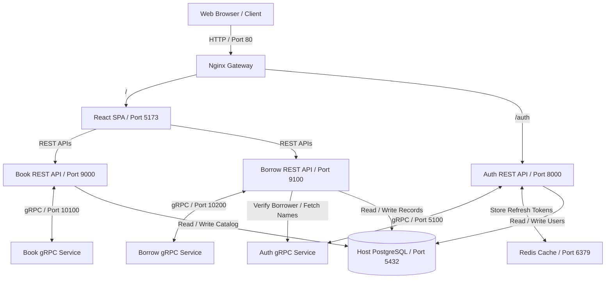

# H.R.M.S & Library Management System

A multi-service platform for managing human resources and a digital library catalog using a microservices-based architecture. Built using FastAPI for backend REST services, gRPC for fast inter-service communication, Redis for token caching, Nginx as an entry gateway, and Vite + React for the single-page application.

---

## 🏛️ System Architecture

The application is structured into isolated, dedicated services communicating over HTTP/REST (external client requests) and gRPC (internal backend calls):



---

## 🔌 Port Mapping & Configurations

| Service | Port | Description |
| :--- | :--- | :--- |
| **Nginx (Gateway)** | `80` | Entrypoint routing to the frontend & Auth REST service. |
| **Frontend** | `5173` | React single-page application (Vite dev server). |
| **AuthService (REST)** | `8000` | REST API for logins, token refreshes, and user actions. |
| **AuthService (gRPC)** | `5100` | gRPC backend for high-speed inter-service queries. |
| **BookService (REST)** | `9000` | REST endpoints for cataloguing books, authors, and genres. |
| **BookService (gRPC)** | `10100` | gRPC backend for querying catalog metadata. |
| **BorrowService (REST)** | `9100` | REST endpoints for book issuing, returns, and fine tracking. |
| **BorrowService (gRPC)** | `10200` | gRPC backend for checking active borrows/fines. |
| **Redis Cache** | `6379` | Shared Redis database for managing user token states. |
| **PostgreSQL Database** | `5432` | Host database (accessible via `host.docker.internal`). |

---

## 🛠️ Setup & Installation

### 📋 Prerequisites
- **Docker & Docker Compose**
- **Python 3.12+** (required for local setup/scripts)
- **PostgreSQL** running on the host machine.
  - Create a database named `hrms_db`.
  - Credentials must match `abhishek` (user) and `admin@123` (password) or be adjusted in `.env` configurations.

### ⚙️ Quick Start

We provide two pre-configured shell scripts to clean ports, boot the container stack, and seed the database.

#### 1. Start the Stack
Run the bootstrap script to automatically set the Docker context, clear conflicting ports, and launch the containers:
```bash
./run.sh
```

#### 2. Run Database Migrations & Seed Data
When running the stack for the first time, apply the database schemas and populate default parameters (permissions, roles, superuser):
```bash
./seed.sh
```

---

## 🔑 Role-Based Access Control (RBAC)

The application has strict, hierarchical role permissions:

1. **ADMIN**
   - Manage employee details and create user accounts.
   - Edit, update, and manage book catalogs.
   - View borrowing logs, payments, and issue fine waivers.
2. **SUPERVISOR**
   - Manage the book/author inventory.
   - View borrow records and log book returns.
3. **STUDENT / CUSTOMER**
   - Search the library catalog.
   - View personal borrowing records, due dates, and outstanding fines.
   - Manage security and update passwords in settings.
   - *Restricted*: Blocked from issuing new books or modifying database records.
4. **USER**
   - Basic guest role with view-only capabilities.
   - *Restricted*: Disabled buttons for issuing books or changing transactional states.

---

## 💻 Development Commands & Manual Startup

If you prefer to run commands individually without the helper scripts:

#### Clear blocked ports manually:
```bash
python3 free_ports.py
```

#### Build and run services in detached mode:
```bash
docker compose up --build -d
```

#### Run migrations manually:
```bash
docker compose exec auth-service alembic upgrade head
docker compose exec book-service alembic upgrade head
docker compose exec borrow-service alembic upgrade head
```

#### Seed the database manually:
```bash
docker compose exec auth-service python setup/seed_db.py
docker compose exec auth-service python setup/create_superuser.py
```
